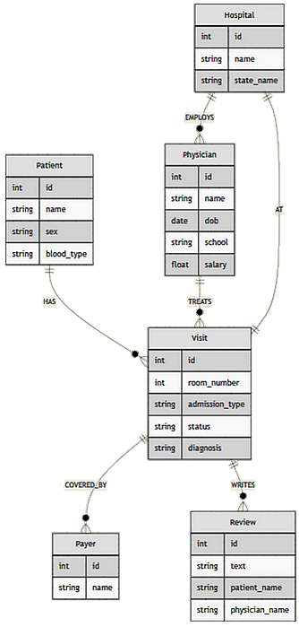

# 🏥 HOSTOBOT

<div align="center">
  
</div>

<br>

<div align="center">

| LangChain | Neo4j | Gemini | OpenAI | MistralAI |
| :---: | :---: | :---: | :---: | :---: |
|  |  |  |  |  |

</div>

<br>

## 🚀 Overview

**HOSTOBOT** is an advanced **Agentic Microservices** demonstration combining **Large Language Models (LLMs)** with a **Graph Database (Neo4j)** to deliver a powerful **Hybrid RAG (Retrieval-Augmented Generation)** system.

Traditional RAG systems often struggle with structured aggregation and relationship-heavy queries. **HOSTOBOT** addresses this limitation using a **Router Agent** that dynamically selects the best tool:

- ⚙️ **Python Tools** → real-time simulations and computations
- 🔎 **Vector Search** → qualitative insights (patient sentiment)
- 🧠 **Graph Cypher Generation** → quantitative analytics

This platform empowers users to effortlessly request complex hospital-related data using natural language queries.

The code is written in Python 🐍.

---

## 🏗️ Architecture

The intelligent core of this system is the **🏥 Hospital RAG Agent**, which dynamically routes queries using the following advanced tools:

- 🛠️ **Current Hospitals** (`get_current_hospitals_tools`) — Retrieves the active list of hospitals directly from the Neo4j database.
- 🛠️ **Wait Times** (`get_current_wait_times`) — Generates a simulated current wait time for patient emergency visits.
- 🛠️ **Most Available Hospital** (`get_most_available_hospital`) — Suggests the most optimal hospital with the highest available capacity.
- 🔗🛠️ **Experiences & Reviews** (`get_reviews`) — Leverages Vector Search capabilities on patient "Review" nodes via a `Neo4jVectorSearchChain`, seamlessly integrating qualitative semantic search into the populated graph database.
- 🔗🛠️ **Graph Querying** (`get_graph`) — Dynamically translates natural language questions into precise Cypher queries using a `CypherChain`, enabling direct quantitative question-answering against the complex graph structure.

---

## ⚙️ Configuration

To run the application, you need the following prerequisites:

- 🔑 **NEO4J Credentials**: URI, Username, and Password.
- 🔑 **AI API Key**: Choose between OpenAI, Gemini, or Mistral.

> **📝 Action:** Provide these credentials in your `.env` file and ensure **Docker Desktop 🐳** is running before proceeding.

---

## 📂 Project Structure

```plaintext

LLM_RAG_ETL_Showcase-Hostobot/
├── .env                        # Critical environment configurations
├── docker-compose.yml          # Orchestration for all 4 services
│
├── img/                        # Images to display in the Readme
│   └── dbscheme.png
│   
├── hospital_neo4j_etl/         # DATA LAYER
│   ├── src/
│   │   ├── hospital_bulk_csv_write.py  # Bulk loader & relationship mapper
│   │   └── entrypoint.sh               # Execution script
│   └── Dockerfile
│
├── chatbot_api/                # LOGIC LAYER (FastAPI)
│   ├── src/
│   │   ├── main.py                     # API entry point & routes
│   │   ├── agents/
│   │   │   └── hospital_rag_agent.py   # Agent & Tool definitions
│   │   ├── chains/
│   │   │   ├── hospital_cypher_chain.py # Cypher generation logic
│   │   │   └── hospital_review_chain.py # Vector search logic
│   │   ├── tools/
│   │   │   └── wait_times.py            # Simulated real-time tool
│   │   ├── models/
│   │   │   └── hospital_rag_query.py    # Pydantic schemas
│   │   └── utils/
│   │       └── async_utils.py          # Retry decorators
│   └── Dockerfile
│
└── chatbot_frontend/           # PRESENTATION LAYER
    ├── src/
    │   └── main.py                     # Streamlit UI logic
    └── Dockerfile


```

---

## 📊 Knowledge Graph Schema

The Neo4j database is modeled to handle multi-hop questions.

### Nodes

- **🏥 Hospital**: `{id, name, state_name}`
- **💰 Payer**: `{id, name}`
- **👨‍⚕️ 🩺 Physician**: `{id, name, dob, school, salary}`
- **🧑‍🤝‍🧑 🤕 Patient**: `{id, name, sex, blood_type}`
- **📅  Visit**: `{id, room_number, admission_type, status, diagnosis}`
- **📝 Review**: `{id, text, patient_name, physician_name}`

### Relationships

- `(Patient)-[:HAS]->(Visit)`
- `(Physician)-[:TREATS]->(Visit)`
- `(Visit)-[:AT]->(Hospital)`
- `(Visit)-[:COVERED_BY]->(Payer)`
- `(Visit)-[:WRITES]->(Review)`
- `(Hospital)-[:EMPLOYS]->(Physician)`

<p align="center">
  
  <br>
  <sub><i>Graph Ontology: Mapping relationships between Patients, Visits, and Providers.</i></sub>
</p>

---

## 🛠️ Installation & Execution

Start the entire microservices stack with a single command:

```bash
docker compose up --build
```

### 🌐 Local Access Points

Once the Docker containers are built and healthy, you can access the localized services:

- 📖 **API Documentation (FastAPI)**: [http://localhost:8000/docs](http://localhost:8000/docs)
- 💬 **Chatbot UI (Streamlit)**: [http://localhost:8501/](http://localhost:8501/)

---

## ❓ Example Questions to Ask

Try testing the agent with some of these complex, natural language questions:

- *Which hospitals are part of the hospital network?*
- *What’s the current wait time at Wallace-Hamilton Hospital?*
- *At which hospitals are patients reporting issues related to billing or insurance?*
- *What’s the average length in days for completed emergency visits?*
- *How are patients describing the nursing team at Castaneda-Hardy?*
- *What was the total amount billed to each payer during 2023?*
- *What is the average charge for visits covered by Medicaid?*
- *Which doctor has the shortest average visit duration?*
- *What is the total billed amount for patient 789's hospital stay?*
- *Which state saw the biggest percentage increase in Medicaid visits from 2022 to 2023?*
- *What’s the average daily billing amount for patients with Aetna coverage?*
- *How many patient reviews have been submitted from Florida?*
- *For visits that include a chief complaint, what percentage also have a review?*
- *What percentage of visits at each hospital include patient reviews?*
- *Which physician has received the highest number of reviews for their visits?*
- *What is the unique identifier for Dr. James Cooper?*
- *Show all reviews associated with visits handled by physician 270 — include every one.*
